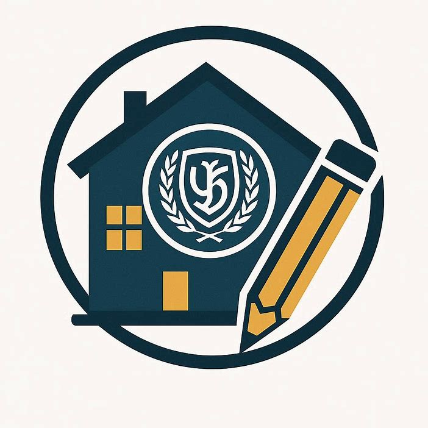

# [НоваСтрой.html](https://github.com/user-attachments/files/28183552/default.html)
<!DOCTYPE html>
<html lang="ru">
<head>
    <meta charset="UTF-8">
    <meta name="viewport" content="width=device-width, initial-scale=1.0, user-scalable=yes">
    <title>НоваСтрой | Инженерное проектирование</title>
    
</head>
<body>

<header class="header">
    

        

            <!-- ЛОГОТИП: прямоугольник с иконкой. Вы можете заменить на  -->
            

    		
	    

            

                <h1>НоваСтрой</h1>
                
инженерное проектирование | строительные компетенции

            

        

        

            

                <a href="#" data-nav="home">Главная</a>
                <a href="#" data-module="smetnoe-delo">Сметное дело</a>
                <a href="#" data-module="upravlenie-proektami">Управление проектами</a>
                <a href="#" data-module="bim-proektirovanie">BIM проектирование</a>
                <a href="#" data-module="pozharnaya-bezopasnost">Пожарная безопасность</a>
                <a href="#" data-module="stroitelnye-materialy">Строительные материалы</a>
                <a href="#" data-module="vvedenie-v-specialnost">Введение в спец.</a>
            

            

                <!-- динамически: кнопки входа/регистрации или профиль -->
            

        

    

</header>

<main id="app-root" class="container">
    
Загрузка платформы НоваСтрой...

</main>

<footer>
    
© 2026 год ЮГУ прототип для проектной деятельности группы СТР51б

    

        Панов И.О., Пуртов А.А., Тарасов С.И., Четвериков Н.Н., Колягин Н.Н., Пащенко В.А, Иванова К.Д.
    

</footer>

<!-- Модальное окно (вход/регистрация) -->

    

        <h3 id="modalTitle">Вход</h3>
        <input type="text" id="loginName" placeholder="Имя пользователя" autocomplete="off">
        <input type="password" id="loginPass" placeholder="Пароль">
        

            <button id="modalActionBtn" class="btn-primary-auth">Войти</button>
            <button id="modalCloseBtn" class="btn-outline" style="background:#ddd;color:#000;">Отмена</button>
        

        
Нет аккаунта? <a href="#" id="switchToRegister">Зарегистрироваться</a>

    

</body>
</html>
